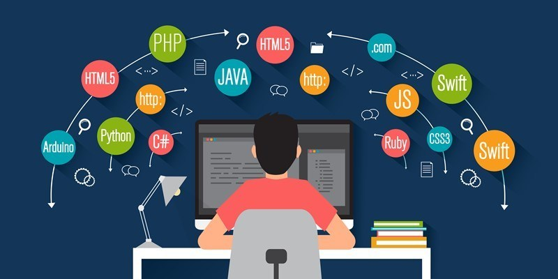

# 1-testeParaCelular

<svg width="2500" height="1309" viewBox="0 0 256 134" xmlns="http://www.w3.org/2000/svg" preserveAspectRatio="xMinYMin meet"><g fill-rule="evenodd"><ellipse fill="#8993BE" cx="128" cy="66.63" rx="128" ry="66.63"/><path d="M35.945 106.082l14.028-71.014H82.41c14.027.877 21.041 7.89 21.041 20.165 0 21.041-16.657 33.315-31.562 32.438H56.11l-3.507 18.411H35.945zm23.671-31.561L64 48.219h11.397c6.137 0 10.52 2.63 10.52 7.89-.876 14.905-7.89 17.535-15.78 18.412h-10.52zM100.192 87.671l14.027-71.013h16.658l-3.507 18.41h15.78c14.028.877 19.288 7.89 17.535 16.658l-6.137 35.945h-17.534l6.137-32.438c.876-4.384.876-7.014-5.26-7.014H124.74l-7.89 39.452h-16.658zM153.425 106.082l14.027-71.014h32.438c14.028.877 21.042 7.89 21.042 20.165 0 21.041-16.658 33.315-31.562 32.438h-15.781l-3.507 18.411h-16.657zm23.67-31.561l4.384-26.302h11.398c6.137 0 10.52 2.63 10.52 7.89-.876 14.905-7.89 17.535-15.78 18.412h-10.521z" fill="#232531"/></g></svg>

body{
    padding: 0;
    border: 0;
    background: auto;
}

.container {
    width: 90%;
    height: 100%;
}
.container img {
    width: 100%;
    height: auto;
}
.container1 img {
    padding: 20px 1px;
    width: 35%;
    height: auto;
}

<!DOCTYPE html>
<html lang="pt-br">
<head>
<meta charset="utf-8">
<meta http-equiv="X-UA-Compatible" content="IE=edge">
<meta name="viewport" content="width=device-width, initial-scale=1, shrink-to-fit=no">
<title> melhoreslinguagensdeprogamação </title>

<link href="https://cdn.jsdelivr.net/npm/bootstrap@5.0.0-beta2/dist/css/bootstrap.min.css" rel="stylesheet" integrity="sha384-BmbxuPwQa2lc/FVzBcNJ7UAyJxM6wuqIj61tLrc4wSX0szH/Ev+nYRRuWlolflfl" crossorigin="anonymous">
<link rel="stylesheet" href="tarefaBootStrap.css">

</head>
<body>
    

        

          

            

                <h1>
                    As linguagens mais ultilizadas de progamação!
                </h1>
            

                
        

    

    

        

          

              
            <h1> 1 – C </h1>
            
 
                
                <h3> 
                    Uma linguagem bastante antiga mas que não sai de moda é a C. Criada em 1972, por Dennis Ritchie, é uma linguagem de baixo nível, muito comum na programação de sistemas operacionais, mas que também pode ser utilizada na criação de softwares para desktop – desde que auxiliada pela utilização de uma linguagem mais amigável com a criação de interfaces, como a C++. Resumindo, é uma linguagem para quem quer lidar com o back-end de aplicações para Desktop.
                </h3>
            

        

    

    

        

          

            <h1> 2 – Java</h1>
            
 
                
                <h3> 
                    Apesar de já ser considerada uma linguagem antiga por muita gente da comunidade de programadores, Java ainda é bastante comum e costuma ser utilizada em diversos tipos de aplicações atualmente. Justamente por ser versátil, essa linguagem ainda tem uma longa história pela frente, e aprender a programá-la vai possibilitar que você crie aplicações tanto para Web, quanto para Mobile e Desktop, sendo uma linguagem valiosa no mercado tecnológico.
                    Mas atenção: a linguagem Java trabalha no lado do servidor, sendo mais indicada para programadores back-end ou Full stack. Uma dica interessante para programação de softwares de computador é que apenas combinando Java com a linguagem SQL de um sistema gerenciador de banco de dados, você já consegue criar aplicações inteiras para desktop.
                </h3>
            

        

    

    

        

          

            <h1> 3 - Python</h1>
            
 
                
                <h3> 
                    Por último, mas não menos importante, uma outra linguagem que tem sido bastante utilizada atualmente é a Python, que foi criada em 1991 por Guido van Rossum.
                    Essa é uma linguagem bastante interessante, principalmente para quem está começando a entrar no mundo da programação, pois um dos objetivos de sua criação foi proporcionar a facilidade de escrita e de leitura dos códigos em Python.
                    É uma linguagem atual, fácil de aprender e prática para quem pensa em seguir carreira no desenvolvimento back-end ou Full-stack.
                </h3>
            

        

    

    

        

          

            <h1> 4 - JavaScript</h1>
            
 
                
                <h3> 
                    Java Script é uma linguagem de programação que foi criada em 1995 por Brendan Eich. Essa linguagem foi pensada para que o front-end de aplicações para Web e Mobile pudesse ser mais flexivel e interativo, diferente das páginas da web antigas baseadas apenas em HTML.

                    O JavaScript trabalha em conjunto com o CSS3 e o HTML5, que são linguagens de estilização e marcação, e é uma das principais linguagens de programação utilizadas na configuração visual de sites atualmente.

                    É importante apenas não confundir Java Script com Java, pois são linguagens diferentes. Aprender JavaScript pode ser muito útil para programadores front-end que queiram programar para Web e/ou Mobile.
                    
                    Uma dica de combinação de linguagens bastante atual com a utilização de JavaScript é usar essa linguagem no lado do cliente, juntamente com o HTML5 e CSS3, e o interpretador Node.js no lado do servidor, tendo assim a oportunidade de criar aplicações para Web inteiras usando apenas JS.
                    
                    
                </h3>
            

        

    

    

        

          

            <h1> 5 - PHP </h1>
            
 
                
                <h3> 
                    Uma das combinações de linguagens mais conhecidos e difundidos ultimamente na programação Web é o que traz HTML + CSS + JavaScript para o front-end e PHP no back-end – se você quer ser programador Web Full stack esse combo é uma dica valiosa.
                    A linguagem de programação PHP foi criada em 1995, por Rasmus Lerdof, e é atualmente uma das linguagens mais utilizadas na programação em servidores http. Uma das principais vantagens dessa linguagem é a sua facilidade de interação com bancos de dados, além da fácil integração com as outras linguagens Web, como a HTML.
                
                </h3>
            

        

    

    

        

            

                <footer> 
                <h2> 
                    Feito por Gabriel Scache Prudencio
                </h2>
                </footer>
            

        

    

 

</body>
</html>
